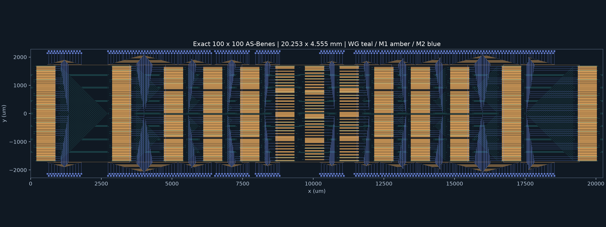

# 100 × 100 photonic switch layout

A parameterized, hierarchical layout generator for a reconfigurable photonic switching matrix, built with **Python, gdsfactory, and KLayout**. The final example uses an **exact-size arbitrary-size Beneš (AS-Beneš) network** with 100 physical inputs and outputs. Earlier Waksman and padded 128-port Beneš designs remain in the history for comparison.



*Rendered from the generated GDS polygons. Inputs are on the west, outputs on the east; electrical pads occupy two rows on each of the north and south sides.*

## Final design

| Property | Verified reference |
|---|---|
| Full layout envelope, including pads | **20.252711 × 4.555112 mm** (92.253367 mm²) |
| Switching core | 596 independently controlled 2×2 MZIs; up to 13 columns |
| MZI geometry | 1 mm long, GSG electrodes, minimum bend radius 20 µm |
| Optical routing | Continuous diagonal permutations; 4,522 reusable crossing instances |
| Electrical routing | Two metal layers plus vias; shared ground; 2,528 vias |
| External pads | 596 signal + 8 common-ground pads; same-row center spacing ≥100 µm |

The network supports any single input/output pair and simultaneous one-to-one permutations. It is **rearrangeably nonblocking**: changing a connection may require changing existing paths. AS-Beneš paths traverse 7–13 MZIs; equal optical loss is not claimed. In single-connection operation, unrequested inputs must remain dark.

## Reduced-device blocking alternative

A separate [100-port pruned Banyan reference](docs/PRUNED_BANYAN.md) uses **400 MZIs and 2,433 physical crossings**, with a verified **12.851003 × 5.535116 mm** envelope. It retains every single input/output connection and a demonstrated simultaneous 100-connection reference, while accepting internal blocking for other permutations. It has exactly 100 external ports per side, a partially retained 128-lane parent, and 56 on-chip placeholder terminations.

Use `examples/benes/pruned-banyan/n100.json` with `n100-choice.json` for the fixed result. The existing AS-Beneš reference and its rearrangeably nonblocking behavior remain available. See the [measured comparison, blocking semantics and reproduction commands](docs/PRUNED_BANYAN.md).

## Engineering approach

- **Parameterization:** explicit topology, device, spacing, pad, and layer configurations.
- **Hierarchy:** reusable MZI, crossing, routing, pad, and via cells in hierarchical GDS.
- **Routing strategy:** continuous optical shuffles, selectable left/right electrode exits, local shared grounds, and pad placement fitted to ordered fanout.
- **Scalability:** recursive topology with O(N log N) switches and bounded layout searches. Larger topology benchmarks do not imply validated larger physical layouts.
- **Verification:** independent path tracing, geometry checks, GDS readback, metal/via connectivity extraction, and injected faults.

Area takes priority over path uniformity. The retained history includes alternatives that were rejected or superseded: for example, folding shortened the chip but substantially increased area. The final electrical refinement reduced area by 7.92% and vias from 3,748 to 2,528 without moving the optical layout.

## Reproduce the final layout

From the repository root, with Python **3.13.5** installed:

```bash
python3.13 -m venv .venv
.venv/bin/python -m pip install -r requirements.lock
.venv/bin/python -m pip install --no-build-isolation --no-deps -e .
export MPLCONFIGDIR="$PWD/.venv/matplotlib-cache"

.venv/bin/python -m pytest -q
.venv/bin/benes-layout generate \
  --config examples/benes/exact100-balanced/regular.json \
  --layout-choice examples/benes/exact100-balanced/regular-choice.json \
  --out output/review-final
.venv/bin/benes-layout verify output/review-final
```

This selects the final fixed floorplan rather than rerunning the historical candidate search. Outputs include `layout.gds`, previews, a resolved configuration, switch settings, pad assignments, and verification reports. Generated bundles remain under ignored `output/`.

**Review validation:** 428 tests passed in a fresh checkout with no pre-existing output, using the pinned development environment. Tests include all 10,000 single input/output pairs at N=100, sampled full permutations, exhaustive small networks, and geometry/electrical fault injection. The final 100-port GDS was separately regenerated and read back. See the [compact result snapshot](docs/assets/final-layout-summary.json) and [exact reproduction instructions](docs/REPRODUCING.md), including Conda, routing a single connection, and regenerating this preview.

## Scope and authorship

This is a **layout-engineering demonstrator**, not a foundry-qualified chip. TFLN coupling ratios, optical loss/crosstalk, RF impedance, the insulated metal-over-optics stack, and manufacturing DRC remain uncalibrated. Finite tests do not enumerate all 100! permutations or establish physical optical performance.

The project was developed through **human design direction and inspection with Codex-assisted programming, GDS generation, and verification**. See [AI workflow and contribution boundaries](docs/AI_WORKFLOW.md).

For deeper review: [final architecture and measured tradeoffs](docs/exact100-balanced.md), [GSG device and paper attribution](docs/BENES_GSG_MZI.md), [crossing shape and source attribution](docs/BENES_COSINE_CROSSING.md), and [AS-Beneš design rationale](openspec/changes/exact100-benes-balanced-routing/design.md). Detailed development notes are primarily in Chinese. Device geometry is inspired by cited public sources; no foundry PDK is bundled.
