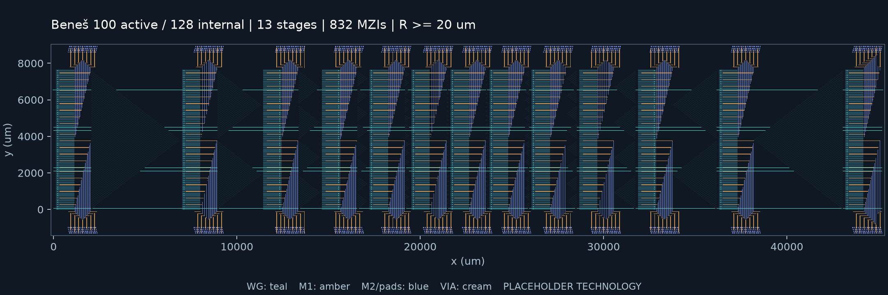
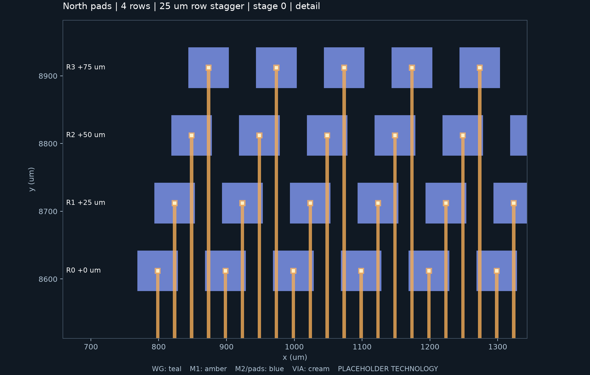

# Beneš 分组 pad 与 60 μm 行距紧凑版

在单条横向光学带、南北各四排 pad、相邻排错开 25 μm 的基础上，完成两步优化：先让各光学级连接附近的 pad 组，再将波导行距从 80 μm 降到 60 μm。完整 100 输入 / 100 输出布局实测为 **45.486 × 10.464 mm**，面积 **475.979 mm²**，相比原四排集中式布局减少 **60.59%**。

继续使用 gdsfactory 导出层级 GDS，128 内部端口、13 级、832 个 TFLN MZI 占位单元、1664 个独立 pad、4992 个 via 和 7680 个 crossing。MZI 长度保持 1000 μm、高度保持 100 μm；最小弯曲半径保持 20 μm。尺寸包含光学网络、电学扇出、pad、备用端口终止和边界余量。

## 实测对照

| 配置 | 整片宽 × 高（mm） | 面积（mm²） | 相比原版面积减少 | 每侧扇出高度层数 |
|---|---:|---:|---:|---:|
| 原集中 pad，80 μm 行距 | 50.286 × 24.018 | 1207.766 | — | 448 |
| 按级分组 pad，80 μm 行距 | 50.286 × 12.984 | 652.928 | 45.94% | 54 |
| **按级分组 pad，60 μm 行距** | **45.486 × 10.464** | **475.979** | **60.59%** | **54** |

“扇出高度层数”是 M1 水平线在不同 y 坐标上的数量，不是增加金属层。仍然只使用 M1、M2 和 via。

第一步把原来集中在芯片中段的 pad 展开到各级附近，减少远距离横向汇聚；不同组之间的扇出可以复用高度。80 μm 分组版的全部光学单元、位置、路由和 IO 均与原四排集中版逐项相同。第二步缩小置换模块的宽度和网络高度，进一步减少 4.8 mm 横向长度、2.52 mm 高度。



当前仍未达到 20 mm 宽度目标。单条带的 MZI、级间置换和电学逃逸通道仍占用横向空间；本轮没有通过缩短占位 MZI 或降低弯曲半径压缩尺寸，也没有宣称全局最优。

## Pad 分组与连接

南北每侧各 13 组，每组对应一个光学级，包含 64 个 pad，排成 **4 × 16**。每侧每排合计 208 个，整片总计 1664 个。

- Pad 保持 60 × 60 μm，组内同排中心距 100 μm，排距 100 μm。
- 从内到外四排沿 +x 偏移 0、25、50、75 μm；南北侧错位方向一致。
- 单组横向跨度 1635 μm，纵向跨度 360 μm。组间空白由光学级位置决定，不要求跨组保持 100 μm 列距，但必须满足金属间距。
- 每组优先对齐本级电学干线中心，边缘组限制在光学核心横向范围内。不能合法放置或布线的参数会被拒绝。
- 各组共享四排 y 坐标。每个端子仍有自己的 pad 和三个 via，不合并回流网络。



蓝色为 M2 pad，橙色为 M1 引线，浅色方块为 via。引线可以从其他排 pad 下方绝缘通过，仅在自己所属 pad 设置 via。

## 参数化、层级、路由、扩展性和验证

| 要求 | 本版实现 |
|---|---|
| Parameterization | 新增 `pad_distribution: stage`，`lane_pitch` 控制波导行距；排数、错位量、尺寸与端口规模继续参数化 |
| Hierarchy | 复用 STAGE/MZI、置换模块、EXCHANGE/CROSSING、PAD/VIA 和每条电学网络单元，GDS 保留层级 |
| Routing strategy | 本级干线连接本级 pad，按 x 顺序分配；依赖关系调度保证水平线与其他 pad 引线不短接，并复用不相交区段的走线高度 |
| Scalability | 小规模覆盖 1、4、5、16 个活动端口与不满四排的局部组；完整物理检查覆盖 100/128，未将逻辑规模测试当作更大 GDS 已验证 |
| Verification | 独立重建组归属、槽位、错位、间距和边界；回读 GDS 多边形与层级，提取金属连接，检查开短路、via、光学连接和最小半径 |

60 μm 版的活动路径几何长度范围为 **45.206–50.758 mm**，所有路径仍经过 13 个 MZI。等开关级数不表示等长或等损耗；本轮继续优先尺寸。

## 生成与回读

在项目根目录使用现有 `.venv`：

```bash
export MPLCONFIGDIR=/tmp/benes-mpl

# 分组 pad 对照版：保持 80 μm 行距
.venv/bin/benes-layout generate --config examples/benes/distributed/pitch80.json --out output/benes/distributed/pitch80

# 本轮紧凑版：60 μm 行距
.venv/bin/benes-layout generate --config examples/benes/distributed/pitch60.json --out output/benes/distributed/pitch60
.venv/bin/benes-layout verify output/benes/distributed/pitch60

# 比较已生成的实际结果
.venv/bin/benes-layout compare output/benes/staggered/offset25 output/benes/distributed/pitch80 output/benes/distributed/pitch60 --out output/benes/distributed/comparison
```

也支持 `--pad-distribution stage --pad-rows 4 --pad-row-stagger 25 --lane-pitch 60 --fold-bands 1`。这些 CLI 选项可覆盖 JSON 配置；上述示例使用固定紧凑候选，其他搜索范围的结果应以生成报告为准。

`pad_distribution` 默认仍为 `central`。`stage` 仅支持四排、单条带；较小网络按本级实际端子数创建不足四排的组，不增加虚构 pad。零错位及其他参数仍须通过同一几何验证。

`pads.csv` 新增 `pad_group`，表示从 0 开始的光学级编号；`column` 在每组内部从 0 开始，`row` 从靠近光学网络的一侧向外编号。集中式布局的 `pad_group` 留空。报告新增布局模式和行距，并记录每组实际包围盒、pad 数、每排数量和扇出高度层数。

## 验证证据

完整回归 **186 项通过**，包含新增 22 项测试。故障注入覆盖错组连接、重复槽位、错位错误、组边界报告错误、组间排高不一致、pad 外形错误、die 未包含外排、缺失 via、金属短路和不足间距，以及报告篡改。

原集中版和两种新布局均重新独立回读。60 μm 版重复生成的规范化几何 hash、GDS 字节、manifest、pad/port CSV、开关设置、尺寸与路径统计一致。

可追溯记录：

- [两步尺寸对比](../examples/benes/distributed/reports/comparison.json)
- [独立回读结果](../examples/benes/distributed/reports/readback.json)
- [光学不变性和扇出高度比较](../examples/benes/distributed/reports/optical_comparison.json)
- [重复生成结果](../examples/benes/distributed/reports/reproducibility.json)
- [回归测试记录](../examples/benes/distributed/reports/tests.json)

完整可再生成的 GDS 和输出位于 `output/benes/distributed/pitch60/`；配置、代表性报告与预览图纳入 Git。器件和层栈仍是占位模型，几何通过不代表真实器件性能、封装可达性或工艺签核。
