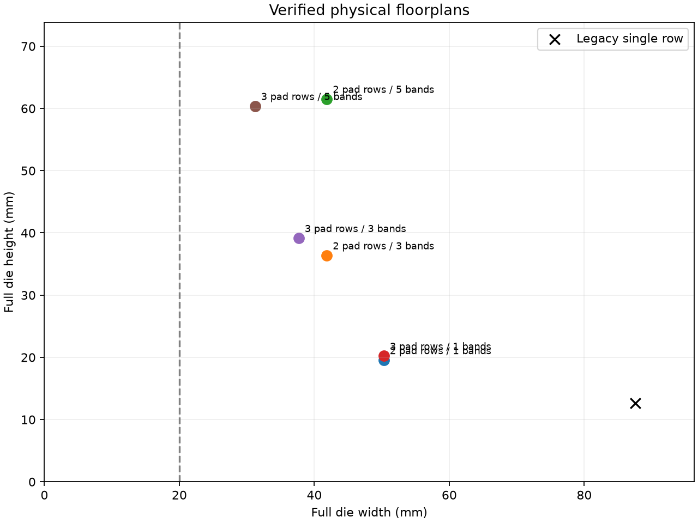

# Beneš 多排 pad 与横向分带实验

后续单条带四排错位方案见 [四排 pad 实现与测量](BENES_STAGGERED_PADS.md)。本文保留两排/三排实验记录。

这版沿用 gdsfactory，保留原来的单排直线布局，增加南北各 **2 排或 3 排 pad**，以及奇数条水平光学带。全部比较针对 100 个活动输入/输出、128 个内部端口、13 级、832 个 MZI 占位单元；每个 MZI 的两个电气端子仍使用独立 pad，共 1664 个 pad、4992 个 via。

## 运行

在项目根目录，使用已经安装依赖的 `.venv`：

```bash
# 第一步：多排 pad，压紧级间距离
.venv/bin/benes-layout generate --config examples/benes/reshape/rows2_bands1.json --out output/benes/reshape/rows2_bands1
.venv/bin/benes-layout generate --config examples/benes/reshape/rows3_bands1.json --out output/benes/reshape/rows3_bands1

# 第二步：折成三条横向带
.venv/bin/benes-layout generate --config examples/benes/reshape/rows3_bands3.json --out output/benes/reshape/rows3_bands3
# 五条带：使用 rows3_bands5.json；两排 pad：使用 rows2_bands3.json / rows2_bands5.json

# 独立读取 GDS，重新检查光电连接与几何
.venv/bin/benes-layout verify output/benes/reshape/rows3_bands3

# 汇总六种已经生成的布局
.venv/bin/benes-layout compare output/benes/reshape/rows{2,3}_bands{1,3,5} --baseline examples/benes/reports/n100.json --out output/benes/reshape/comparison
```

也可直接传入 `--pad-rows 2` / `--pad-rows 3` 和 `--fold-bands 3` / `--fold-bands 5`。示例配置把候选限定为同一紧凑参数组，便于比较；常规生成仍可搜索不同级间余量、通道宽度和正反行序。几何不合法的候选会被拒绝，不会输出成功版图。

## 五项设计要求

| 要求 | 本版实现 |
|---|---|
| Parameterization | `pad_rows`、`pad_row_pitch`、`fold_bands`、`fold_gap`、`bundle_pitch`；保留端口映射、MZI、波导、金属和 pad 参数 |
| Hierarchy | 完整级阵列，复用 SPLIT/MERGE、EXCHANGE、CROSSING、压缩通道、圆弧和 VIA；输出保持 GDS 单元引用 |
| Routing strategy | 光学分带蛇形连接；电气穿过各带对齐的直波导窗口，最后连接南北多排 pad |
| Scalability | 任意活动端口数映射至 2 的幂内核；折叠条带数为不超过级数的奇数；本次完整物理验证到 100/128 端口 |
| Verification | 规范图比对、旋转后端口连续性、光学多边形间距、解析半径、GDS 多边形与引用回读、电气导体提取、via enclosure、开短路及重复生成 |

默认参数：波导宽 1 µm、间距至少 5 µm、弯曲半径至少 20 µm，MZI 长 1000 µm，光学行距 80 µm，pad 为 60 × 60 µm，行列中心距 100 µm。压缩波导束中心距 6.01 µm，条带之间额外留 200 µm。这些是占位工艺参数，未经过真实 TFLN 器件或封装验证。

### CROSSING 已是独立单元

已有四端口 `CROSSING` 单元继续复用：`SPLIT/MERGE → EXCHANGE → CROSSING + BEND`。完整 100/128 版图中的 crossing 数仍为 **7680**；新增折返不会增加 crossing。每条路径仍经过 13 个 MZI。

### 多排 pad 的电气连接

MZI 端子经 M1 接至 M2 竖直干线，再在光学阵列外转回 M1 扇出；M1 竖直 pad 引线可从内排 M2 pad 下方经过，只在自己的 pad 处放置连接 via。每个 net 有三个 via，所有返回端仍独立。

扇出根据源干线和 pad 引线的顺序建立先后约束，交错的水平段放在不同高度，互不干扰的段共用高度。它的实际高度包含在芯片尺寸中。两层金属的绝缘、pad 下方走线和 M2 跨直波导窗口是明确的占位工艺假设；多排 pad 的键合可达性仍需结合实际封装设计。

### 光学折叠

相邻条带分别使用 0°/180° 放置。三级带划分为 4/5/4 级，五级带划分为 2/3/3/3/2 级，保持全部级和连接。每次折返前压缩 128 路波导束，用同心半圆回转，再展开到原来的 80 µm 行距。压缩段使用 20 µm 圆弧，回转段最小半径为 100 µm。

各条带的电极逃逸通道在横向对齐，使 M2 干线穿过其他条带时仅经过获准的直波导段。活动输入和输出分别延伸到西、东外部接口线；备用端口的终止单元及边缘余量计入整片边界。

## 尺寸与取舍

| 南北每侧 pad 排数 | 横向条带数 | 整片宽 × 高 (mm) | 面积 (mm²) | 活动路径长度范围 (mm) |
|---:|---:|---:|---:|---:|
| 1（原基线） | 1 | 87.56 × 12.64 | 1107.13 | 87.280–94.820 |
| 2 | 1 | 50.29 × 19.53 | 982.05 | 50.006–57.546 |
| 3 | 1 | 50.29 × 20.23 | 1017.46 | 50.006–57.546 |
| 2 | 3 | 41.84 × 36.38 | 1522.33 | 133.922–141.750 |
| 3 | 3 | 37.68 × 39.16 | 1475.47 | 129.759–137.587 |
| 2 | 5 | 41.84 × 61.53 | 2574.39 | 196.441–213.631 |
| 3 | 5 | 31.20 × 60.39 | 1884.29 | 185.805–202.996 |

六种布局均通过规范图、光学几何、GDS 回读和电气连通检查。若优先整片面积，两排直线版最小，较原基线面积减少约 11.3%；若希望缩短最长边并接近方形，三排三条带版更合适，宽度减少约 57.0%，但面积增加约 33.3%。三排五条带宽度最小，代价是高度超过 60 mm，面积增加约 70.2%。

折叠的长路径来自压缩/展开波导束及重复穿越条带的距离。布局可连通不意味着光学损耗可接受；在有真实器件和传播损耗预算后，需要重新评估折叠数。




这里的 20 mm 是横向软目标。固定每侧 832 个 pad 和 100 µm 列间距时：

- 两排：`(ceil(832/2)-1) × 100 + 60 = 41.56 mm`。
- 三排：`(ceil(832/3)-1) × 100 + 60 = 27.76 mm`。

这是 pad 阵列本身的下界，还没包含边缘余量。此次没有缩小 pad、共用返回端或增加第四排来强行达到 20 mm。搜索范围也不构成全局最优证明。

## 验证记录与产物

每个输出目录包含 `layout.gds`、`preview.png`、`detail.png`、配置、规范图、连接设置、层级 manifest、pad/port CSV 和 `report.json`。`report.json` 同时报告实际宽高、面积、路径长度/弯曲/交叉差异及验证结果。

`compare` 汇总生成时的验证报告，不替代重新读取 GDS 的 `verify`。小规模回归覆盖多排、反向行序、3/5 条带、错误旋转、错位 pad、错误半径、断开的压缩段、缺失 via、跨 pad 意外连接和未授权光电交叉。完整 100 端口测试报告保存在 `examples/benes/reshape/reports/`。

均匀性依然低于尺寸优先级：折叠保证等 MZI 级数，但不保证等几何长度、等损耗或等延迟。现有 MZI、crossing、终止器及层栈仍是占位结构，不能把通过几何检查视为流片签核。

本次完整回归共 **135 项通过**。三排三条带的两次独立生成具有相同的层级 manifest hash、路径统计和逐字节相同的 GDS；记录见 `reports/tests.json` 与 `reports/reproducibility.json`。
