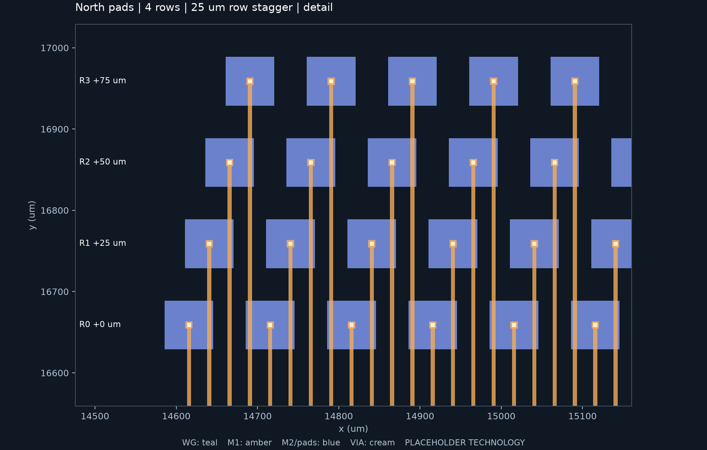

# 单条带 Beneš：南北四排错位 pad

本版把光学网络展开为 **1 条横向带**，南北各放置 **4 排 pad**。每侧 832 个，每排 208 个，相邻排沿全局 +x 方向错开 **25 μm**。从靠近光学网络的一排向外，排号为 R0–R3，横向偏移为 0、25、50、75 μm；南侧仅 y 方向向外递减，x 错位方向与北侧相同。

沿用 100 个活动输入/输出、128 个内部端口、13 级和 832 个 MZI；1664 个 pad 均独立连接，仍使用 M1/M2 两层金属及 4992 个 via。CROSSING 继续作为独立层级单元复用，完整布局共有 7680 个 crossing，光学弯曲半径至少 20 μm。

## 测量结果

pad 尺寸保持 60 × 60 μm，行列中心距均为 100 μm。

| 单条带配置 | 单侧 pad bank 宽 × 高 (mm) | 整片宽 × 高 (mm) | 整片面积 (mm²) |
|---|---:|---:|---:|
| 原两排 | 41.560 × 0.160 | 50.286 × 19.529 | 982.052 |
| 原三排 | 27.760 × 0.260 | 50.286 × 20.233 | 1017.457 |
| 四排对齐，零错位 | 20.760 × 0.360 | 50.286 × 24.018 | 1207.766 |
| **四排，每排错开 25 μm** | **20.835 × 0.360** | **50.286 × 24.018** | **1207.766** |

四排错位 pad 的横向跨度是 `207 × 100 + 60 + 75 = 20835 μm`。这个数仅描述 pad 阵列，整片宽度仍由单条带光学网络决定。集中后的四排 pad 需要更高的电气扇出区，所以本次整片面积没有下降；相比原三排单条带增加约 18.7%。零错位对照与 25 μm 错位版的最终扇出高度相同，因此整片尺寸相同。

四种配置的规范图、MZI 位置、全部光学路由、外部接口及其引用的光学单元多边形/层级逐项相同。本次外部 IO 延伸量变化为零，活动路径几何长度范围仍约 50.006–57.546 mm。比较记录见 [optical_comparison.json](../examples/benes/staggered/reports/optical_comparison.json)。



图中蓝色为 M2 pad，橙色为 M1 引线，浅色小方块为 via。M1 可以从其他排 M2 pad 下方经过，只有指定 pad 处设置连接 via。

## 运行

在项目根目录使用现有 `.venv`：

```bash
# 紧凑参数组：完整 100 端口四排错位版
.venv/bin/benes-layout generate --config examples/benes/staggered/offset25.json --out output/benes/staggered/offset25

# 零错位对照
.venv/bin/benes-layout generate --config examples/benes/staggered/offset0.json --out output/benes/staggered/offset0

# 独立回读 GDS 并验证
.venv/bin/benes-layout verify output/benes/staggered/offset25

# 与现有单条带结果比较
.venv/bin/benes-layout compare output/benes/reshape/rows2_bands1 output/benes/reshape/rows3_bands1 output/benes/staggered/offset0 output/benes/staggered/offset25 --out output/benes/staggered/comparison
```

也可以直接使用 `--pad-rows 4 --pad-row-stagger 25 --fold-bands 1`。默认候选搜索范围比上述固定紧凑示例更宽，实际尺寸以该次生成的报告为准。`pad_row_stagger` 缺省为 0，既有一至三排和折叠配置继续保持原来的行为。

本轮四排仅支持单条带。错位量必须有限、非负、位于 0.001 μm 数据库网格上，四排总偏移必须小于列间距。其他错位量还要满足引线间距及实际路由检查；不可布通的参数会明确拒绝，不会生成成功标记。

## 参数化、层级与路由

- **Parameterization**：排数、错位量、pad 尺寸、行列 pitch、端口规模均由配置驱动。末列不足四个 pad 时只分配真实端子，不创建虚构网络。
- **Hierarchy**：复用 PAD/VIA、MZI、置换模块、EXCHANGE/CROSSING，GDS 保留单元引用。
- **Routing strategy**：先计算实际 pad 实体，再分配 M1 引线。默认四相错位时引线接在 pad 中心；对齐四排使用 pad 内分离引线。排序扇出满足间距，每 net 通过三个 via 连接端子与自己的 pad。
- **Scalability**：小规模覆盖极少端口和末列不满情况；完整物理验证覆盖 100 活动/128 内部端口。更大规模仍需实际生成验证。
- **Verification**：独立检查实际 pad 排号、列号、偏移、边界、光电连续性、金属宽度/间距、via enclosure、GDS 多边形和引用层级。

## 验证与产物

完整回归 **164 项通过**。重建既有 100 端口两排直线、三排直线及三排三条带配置，其实际单元、光电路由和边界与此前保存的版图逐项一致（见 `compatibility.json`）。新增反例覆盖错位错误、漏 pad、重复槽位、pad 尺寸错误、边界漏掉外排、缺失 via、异网 pad 下误加 via、金属过小间距及报告篡改。四排错位和对齐的完整 100 端口布局均通过全部物理检查。

25 μm 错位版重复生成的规范化几何 hash、pad CSV、尺寸和路径统计一致，GDS 也逐字节一致。结果保存在 [tests.json](../examples/benes/staggered/reports/tests.json) 和 [reproducibility.json](../examples/benes/staggered/reports/reproducibility.json)。

每个生成目录包括完整 `layout.gds`、整片 `preview.png`、光学局部 `detail.png`、四排 pad 局部 `pads_detail.png`、`pads.csv`、配置、manifest 和报告。CSV 新增 `row`、`column`、`row_offset_um`；报告分别列出单侧实际 pad bank 包围盒、宽高、每排行数，以及完整整片尺寸。

MZI、crossing、终止器和层栈仍为占位结构；M1 在 M2 pad 下方绝缘走线及 M2 跨直波导的窗口仍沿用此前工艺假设。几何验证不代表真实封装可达性、光学损耗或流片签核。
