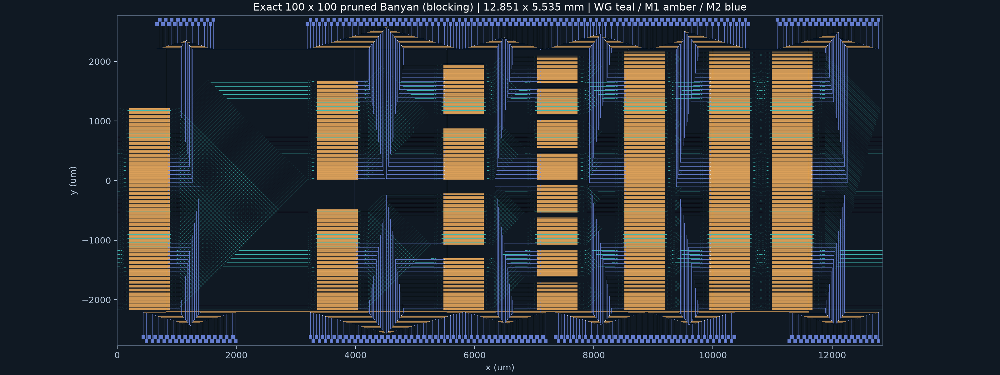
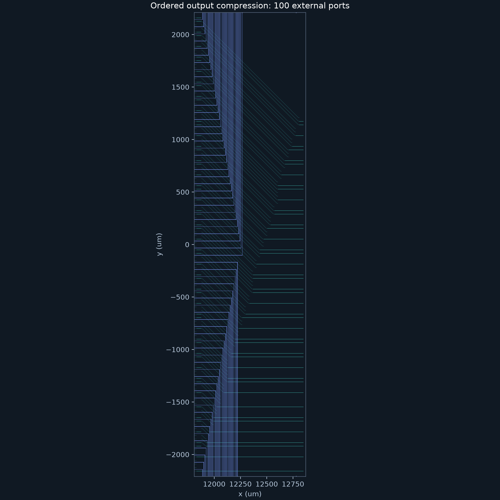
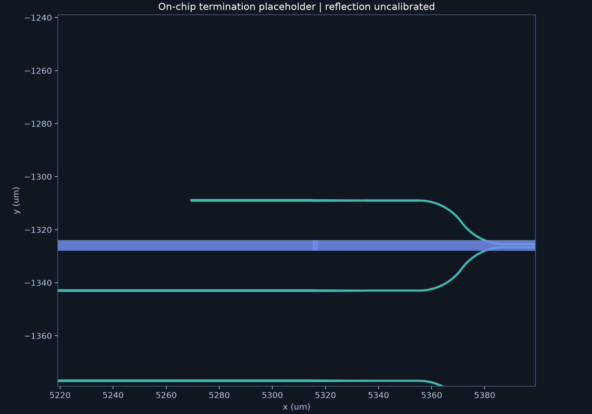
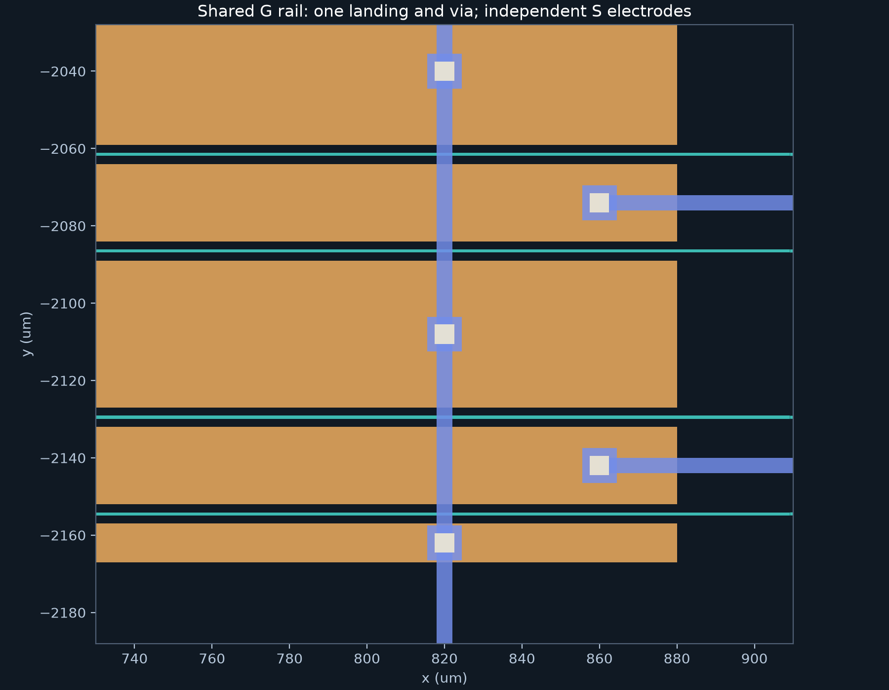
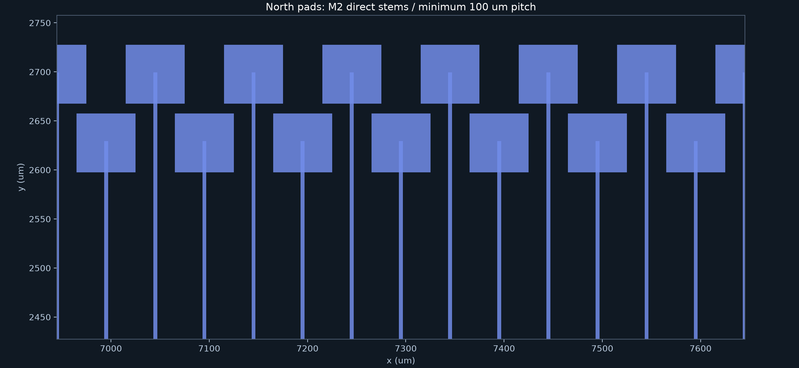

# 100 路裁剪 Banyan：400 MZI

本参考采用单平面、7 级递归 Banyan，外部严格 100 输入/100 输出，内部母网地址空间为 128。400 个 MZI 全部独立控制。网络有内部阻塞；默认的满载参考可同时接通 100 路，每个输入到每个输出也均有唯一的单连接路径，但不保证任意完整置换同时可达。



## 实测结果

| 指标 | 原 AS-Beneš | 裁剪 Banyan |
|---|---:|---:|
| 外部输入 / 输出 | 100 / 100 | 100 / 100 |
| MZI | 596 | 400（减少 32.89%） |
| 实际全片 crossing | 4,522 | 2,433（减少 46.20%） |
| 信号 / 共地 pad | 596 / 8 | 400 / 8 |
| Via | 2,528 | 1,639 |
| 共享 G 接点 | 710 | 418 |
| 片内终端 | 0 | 56：28 输入端 + 28 输出端 |
| 实际宽 × 高 | 20.252711 × 4.555112 mm | 12.851003 × 5.535116 mm |
| 全片面积（含 pad） | 92.253367 mm² | 71.131792 mm²（减少 22.90%） |
| 每条有效路径 MZI 数 | 7–13 | 7 |
| 任意一对一置换同时可达 | 是，可重排无阻塞 | 否，必须无内部冲突 |

该布局宽度达到 20 mm 软目标。高度较原参考增加；面积比较已包含这部分代价。原参考为 [regular.json](../examples/benes/exact100-balanced/regular.json)，原摘要见 [final-layout-summary.json](assets/final-layout-summary.json)。新结果的完整数字、选择记录及验证摘要见 [pruned-banyan-summary.json](assets/pruned-banyan-summary.json)。

最终选择：banyan-p34-03，间距 34 µm，逐列引出 `RRLLLLR`，pad 相位 -25 µm。共比较 18 个完整候选，范围为 34/35 µm、每个间距最多 8 个估算优选方向加全右出对照。通过几何、电学及 crossing 硬约束后，按实际面积、宽度、crossing、信号转折、线长、请求路径长度差、稳定 ID 排序。这里只声称有限候选中的最优。

## 端口选择和阻塞语义

母网规模 P 为不小于 N 的最小 2 的幂；边界 s 的块大小为 `P >> s`，块内映射为 `i//2 + (i%2)*(size//2)`。输入选择母网前 N 口；输出选择这些输入在全 bar 状态到达的母网端口，按母网行号升序重新分配公开输出号。`network.json` 明确导出两侧映射及 `reference` 满载置换，公开恒等置换与该参考通常不同。

各级 MZI 数为 `50, 50, 52, 56, 64, 64, 64`；各级间有效边为 `100, 100, 104, 112, 128, 128`。裁剪依据所有选定输入到所有选定输出的路径并集。不能将两端都取母网前 100 口：独立最大流验证该反例最多同时 79 路，虽然全部单连接可达。

求解器只处理实际请求，不补全未请求端口；所有未约束开关默认为 bar，未请求输入必须保持暗态。状态文件覆盖全部开关，标记 `blocking=true, rearrangeable=false`。重复或越界端口属于输入错误；内部状态或链路冲突报告 `blocked`，包含冲突的两条请求及 stage/switch/edge 位置。请求顺序不会改变结果。未请求输入在当前设置下可能到达片内终端，不能将状态表解释为完整公开置换。

## 物理实现

保留 1 mm MZI、680 µm 电极、GSG、半径至少 20 µm、固定 20×20 µm cosine crossing、M1/M2/VIA、共地及单带西入东出约束。400 个 S pad 和 8 个共地 pad 均分南北两侧，每侧两排各 102 个，pad 为 60 µm 方形，同排中心距至少 100 µm、行距 70 µm，末段直接用 M2 连接。

连续 shuffle 按有效轨迹裁剪：双轨保留 crossing，单轨将 crossing 替换成同中心线普通直波导，空轨删除。导出仅包含可达层级；不引用未裁剪的母网来假装减少器件。图级交叉为 `1225, 600, 312, 168, 96, 32`，合计 2,433；本次 GDS 的实际全片计数也为 2,433。输出压缩和终端避让没有新增 crossing；两种计数仍分开报告。



未用 MZI 引脚以稳定的 `(switch_id, pin)` 绑定片内终端。终端连接有明确端点和方向；终端本体位于电学干线禁布区之外。沿用已有的绝缘 M2 跨普通被动波导规则，没有增加跨终端本体的豁免。终端为几何占位模型，`placeholder=true, reflectionless=false`，不宣称已验证吸收、低反射或插入损耗。



地轨仅在连续的实际器件行之间共享，每轨一个落点和 via；光学终端布置在器件列外，不侵入共享地轨。GDS 金属提取得到 400 个独立 S 网络及 1 个 G 网络，且没有浮空导体。





## 复现和请求示例

使用项目已有 `.venv` / `requirements.lock`，在仓库根目录运行：

```bash
export MPLCONFIGDIR="$PWD/.venv/matplotlib-cache"
.venv/bin/benes-layout generate \
  --config examples/benes/pruned-banyan/n100.json \
  --layout-choice examples/benes/pruned-banyan/n100-choice.json \
  --out output/benes/pruned-banyan/reproduced
.venv/bin/benes-layout verify output/benes/pruned-banyan/reproduced
```

省略 `--layout-choice` 会重新比较完整候选。新模式省略 `--connections` 时使用满载 `reference`；原 Beneš/AS-Beneš 仍默认 `identity`。显式 `identity`、`reverse`、JSON 请求或冒号请求均按原样求解，不替换成参考。只生成一个连接的控制状态：

```bash
.venv/bin/benes-layout solve \
  --config examples/benes/pruned-banyan/n100.json \
  --connections 0:99 \
  --out output/benes/pruned-banyan/single-settings.json
```

`--connections none` 返回全 bar 状态并把全部输入标为暗态。可用 `--connections 0:0,2:1` 演示内部阻塞；进程非零退出并记录位置，不输出成功控制结果。

新模式生成在隔离目录中求解、布图和验证，全部通过后才发布。失败保留已有输出，另写同级 `<目标名>.failure.json`；几何候选失败还保留 `<目标名>.failed-search.json`。错误消息明确旧包仍是旧结果；不要把它当成本次请求成功。独立 solve 也原子发布完整状态文件。

生成包包含 `config.json`、`network.json`、`manifest.json`、`settings.json`、`report.json`、`layout.gds`、`cell_names.json`、`ports.csv`、`pads.csv`、`terminations.json`、`overpass_windows.json`、`selected-choice.json`、`search.json` 与总览/局部图。全部 10,000 对拓扑路径统计和本次请求路径统计分别存放在报告中；固定 7 个 MZI 不等于长度或光学损耗相同。

## 验证范围

本次全量回归 493 项全部通过，随后新增的活动路径进入终端故障测试也通过。原 100 路 AS-Beneš 固定参考重新生成并独立验证，尺寸、596 MZI、4,522 crossing 与 2,528 via 保持一致。选定 Banyan 候选另外生成两次，规范化几何、网络、状态、路径和指标均与完整候选搜索产物一致；随后提交阻塞请求，确认旧包完整保留并仍可独立验证。复现摘要同时保存在生成包的 `reproduction.json` 与上述可审查摘要中。

- 2–8 路全部一对一置换，与独立全开关状态枚举的可路由集合对照。
- 100 路全部 10,000 个单连接；满载参考；种子 17 的 100 组参考子集和 100 个随机完整请求，核对成功或真实阻塞。
- 独立母网路径并集、端口选择最大流、56 个终端与每个器件四引脚的唯一归属。
- 5/7/12/13 路全片 GDS，覆盖 34/35 µm 和左右出线；光学开路/错边/错终端/crossing/半径，以及共地开路、S-G 桥接、丢失/重复 via、浮空金属、pad 故障测试。
- 100 路候选均独立回读 GDS 多边形和层级，检查光学连续性、切向、半径、净距、两路 crossing 贯通、电学隔离、全部电极探针与 pad 的实际连接。

几何和连接验收不代表制造 DRC、光学损耗、反射、串扰、RF 阻抗或器件工艺已校准。原 AS-Beneš 的任意置换能力仅属于原模式；新模式的单平面阻塞是本方案明确接受的器件数量取舍。
